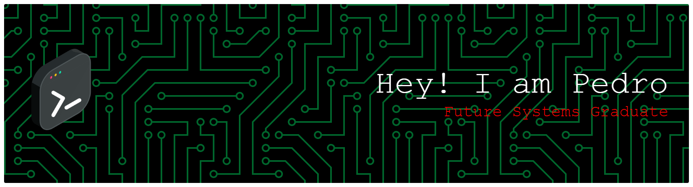

<!-- Tu Banner Personalizado -->

 

  

<h3>pedro@github ~ $ ./contributions.sh</h3>

  

<h3>pedro@github ~ $ whoami</h3>
<table>
  <tr>
    <td valign="top"></td>
    <td valign="top"></td>
  </tr>
</table>

 

<h3>pedro@github ~ $ tech-stack --list</h3>

  
  
  
  
  
  

 

<h3>pedro@github ~ $ git stats --user</h3>

  

  
  

